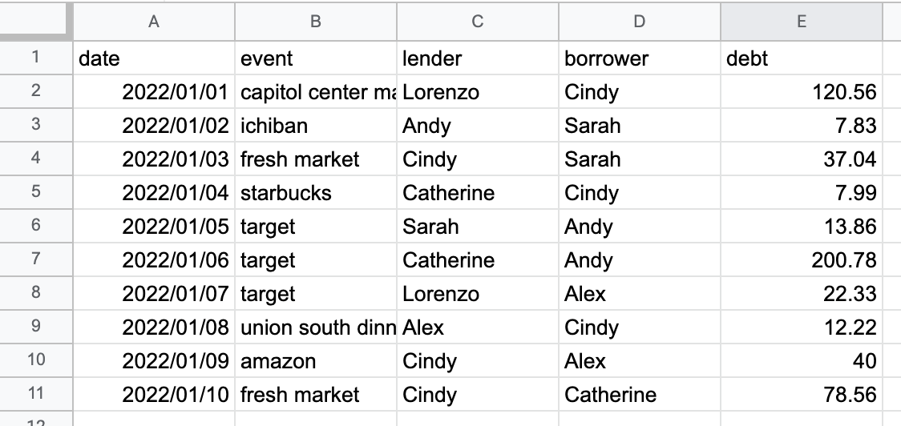
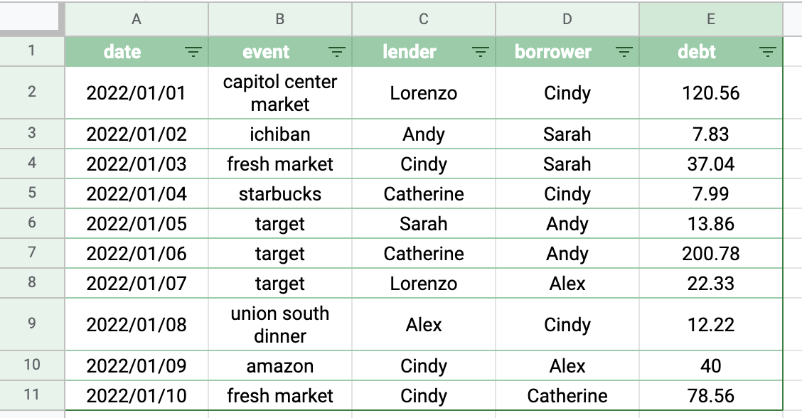
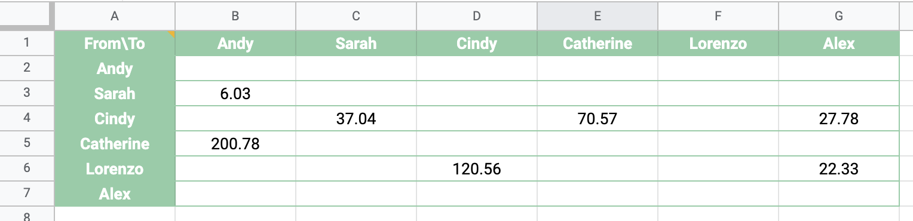
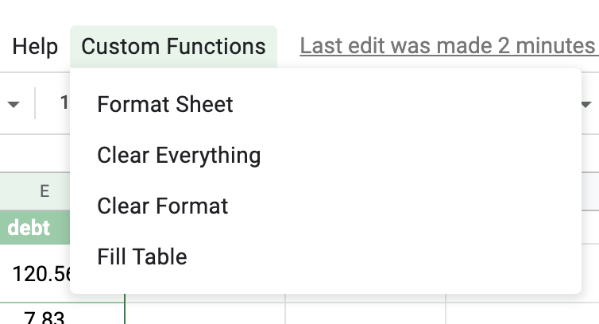

<!--more-->

Money-borrowing happen almost every second, especially between friends. Today I want to talk about how to facilitate our repayment process so that the minimum transactions can be done. Specifically, here is a google sheet demo I have created to imitate money-borrowing between, say 6 friends. 

The first thing that comes into my mind is that the format could have a bit extra work. The second thing is that whether we could automate to extract a "owed money" matrix so that everyone knows exactly how much they need to pay back to the other person? It particularly annoys me where I need to go back and forth to click through buttons to reformat ,and the automation is best done with assistance of programming tool. That is when Google Apps Script comes into my mind! It can help build web applications that perfectly blends into Google Spreadsheet and ease our lives. 

The final formatting product looks like this:

The "owed money" or "debt" matrix looks like this:

You can see clearly that now Andy still needs to pay back \$6.03 to Sarah! Although Andy did once lend  \$7.83 to Sarah, later Sarah lended another \$13.86 to Andy. Instead of two transactions where Sarah returns \$7.83 to Andy and Andy returns \$13.86 to Sarah, only one transaction can do the job!

This is just a small demo. The application needs more optimization for sure. Stay tuned!

## Demo Files 

If you want to get a hands-on experience, you can try out the demo files. You are welcome to adapt and improve to make your own fit. There are three sheets called `transaction`, `personal info`, and `debt matrix` under spreadsheet `Copy of transaction app`. You can ignore the `personal info` one, which I originally intend to make an automated email app to remind debters. (will do in the future!)

* [Copy of transaction app](https://docs.google.com/spreadsheets/d/18AdsOHVXT0gokABQF0BHf5A-ryy_oxR1jGM0zk2w9SU/edit?usp=sharing)

## 1. Resources & References!

I referred to some resources which I found particularly useful:

* [Google Apps Script Tutorial for Beginners](https://www.youtube.com/watch?v=Nd3DV_heK2Q) (My format function definitely refers to this! Special thanks for the inspiration.)
* [Google Apps Script Documentation: Spreadsheet](https://developers.google.com/apps-script/reference/spreadsheet/spreadsheet-app)
* stackoverflow (recommended!)
* special thanks to [Lorenzo Lu](https://lorenzo-lu.github.io/virtual_root/) who has helped me along the process!

## 2. Instructions

If you click the `Custom Functions` in the top menu bar, you will see these four functions. 

1. `Format Sheet` is what you can apply to any of the three sheets. It will apply the same formatting to all except the `debt matrix`, which needs different handling regarding its left and top side. 

2. `Clear Everything` is to clear both format and content, so essentially swipe off everything. 

3. `Clear Format`, as its name suggests, clears only the format but preserves the content. 

4. `Fill Table` is intended to be applied to the last sheet: `debt matrix`. It updates the table in whole every time you run it to matches with the data in `transaction` table. 

To achieve the intended effect of the above debt matrix, you need to run `Fill Table` first and then `Format Sheet`. 

Also, for the firs time you apply any of the function, script will ask for permission to access your personal account. After allowing, you will be good to go!