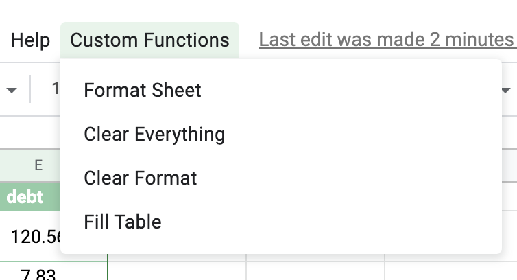

<!--更多-->

借钱几乎每秒都在发生，尤其是在朋友之间。今天我想谈谈如何促进我们的还款过程，以便可以完成最少的交易。具体来说，这是我创建的一个 google sheet demo，用于模拟 6 个朋友之间的借贷。

我想到的第一件事是格式可能有一些额外的工作。第二件事是，我们是否可以自动提取“欠款”矩阵，让每个人都知道他们需要偿还给对方多少钱？它特别让我烦恼，我需要来回点击按钮重新格式化，而自动化最好在编程工具的帮助下完成。这就是我想到 Google Apps 脚本的时候！它可以帮助构建完美融入 Google 电子表格的 Web 应用程序并简化我们的生活。

最终的格式化产品如下所示：

“欠款”或“债务”矩阵如下所示：

您可以清楚地看到，现在安迪还需要向莎拉偿还 6.03 美元！虽然安迪曾经借给莎拉 7.83 美元，但后来莎拉又借给安迪 13.86 美元。与莎拉向安迪返还 7.83 美元和安迪向莎拉返还 13.86 美元的两笔交易不同，只有一笔交易可以完成这项工作！

这只是一个小演示。应用程序肯定需要更多优化。敬请关注！

## 演示文件

如果您想获得动手体验，可以试用演示文件。欢迎您适应和改进，以使自己适合自己。在电子表格`Copy of transaction app`下有三张表，分别称为`transaction`、`personal info`和`debt matrix`。您可以忽略“个人信息”，我最初打算制作一个自动电子邮件应用程序来提醒债务人。 （将来会做！）

* [交易应用程序副本](https://docs.google.com/spreadsheets/d/18AdsOHVXT0gokABQF0BHf5A-ryy_oxR1jGM0zk2w9SU/edit?usp=sharing)

## 1. 资源和参考！

我提到了一些我发现特别有用的资源：

* [Google Apps 脚本初学者教程](https://www.youtube.com/watch?v=Nd3DV_heK2Q) （我的格式功能绝对是指这个！特别感谢您的启发。）
* [Google Apps 脚本文档：电子表格](https://developers.google.com/apps-script/reference/spreadsheet/spreadsheet-app)
* stackoverflow（推荐！）

## 2. 说明

如果您单击顶部菜单栏中的“自定义功能”，您将看到这四个功能。

1. `Format Sheet` 是你可以应用到三张表中的任何一张。它将对除“债务矩阵”之外的所有内容应用相同的格式，该矩阵需要对其左侧和顶部进行不同的处理。

2. `清除一切`是清除格式和内容，所以基本上刷掉一切。

3. `Clear Format`，顾名思义，只清除格式，保留内容。

4. `Fill Table` 旨在应用于最后一张表：`debt matrix`。每次运行时它都会更新整个表以匹配“事务”表中的数据。

要达到上述债务矩阵的预期效果，您需要先运行`Fill Table`，然后运行`Format Sheet`。

此外，在您第一次应用任何功能时，脚本会请求访问您的个人帐户的权限。许可后，你就可以开始用了！