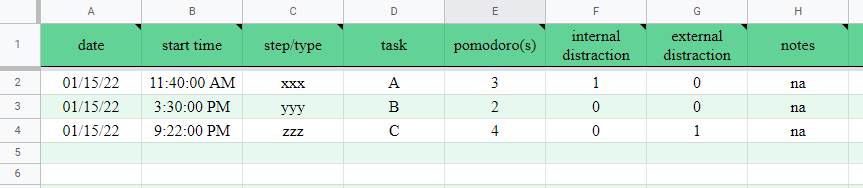
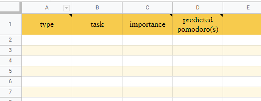

<!--more-->

Stuggling with time management for the past semester, I came across the [Pomodoro Technique](https://francescocirillo.com/pages/pomodoro-technique) developed by Francesco Cirillo. Although it was something I've heard of a long time ago, I still decided to give it a try. This time I used Google Sheets as my Pomodoro tracker. 

I have divided the tracker to 3 sheets, they are (1) **Today's To-Do**, (2) **Daily Log**, and (3) **To-Dos** (See below images). I would use **To-Dos** to record my general goals I wanna accomplish either in short run or long run. Then, at the beginning of each day, I pick some tasks I would like to focus on and put those to **Today's To-Do**; at the end of each day, I manually enter today's finished tasks and organize them into **Daily Log**, which is an extensive table that recorded what I did each date.






After manually transferring information from **Today's To-Do** to **Daily Log** for a while, I got tired of the tedious "copy and paste" process. Thinking it might be a good chance to pick up some new skills, I looked up how to read and write Google Sheets using the elegant [gspread API](https://docs.gspread.org/en/latest/api.html) and it turned out to save so much time by just running a short script. 

## Demo Files (Follow along!)

If you want to get a hands-on experience, you can use the demo files to code along with me. You are welcome to adapt and improve to make your own fit. 

* [populate log.ipynb: Python script](https://colab.research.google.com/drive/1Fv7dPlDlfu4ncWpW4evg6mk5lZd3fF4l#scrollTo=9eA649f6cosl)
* [Pomodoro Technique Google Sheets](https://docs.google.com/spreadsheets/d/1oogWtA5vSlcZTYzYL1CDrv4FIytao2MBBq6UmCKHLK4/edit#gid=0)

## 1. Imports

```code
import pandas as pd
from google.colab import auth
import gspread
from oauth2client.client import GoogleCredentials
from datetime import date, datetime
import pytz
import os
import json
```

## 2. Authenticate and Authorize

```code 
auth.authenticate_user()
gc = gspread.authorize(GoogleCredentials.get_application_default())
```

The first step is to enable Google Sheets API to access your spreadsheets. "Authentication and authorization are mechanisms used to verify identity and access to resources, respectively." You can learn more about authentication and authorization [here](https://developers.google.com/workspace/guides/auth-overview). 

But essentially, once you run these two lines of code, a URL will pop up and opens a new tab in your browser which requires you to grant access. After that, copy the url and paste that to the box says verification. 

## 3. Retrieve your sheets

```code
url = "https://docs.google.com/spreadsheets/d/1oogWtA5vSlcZTYzYL1CDrv4FIytao2MBBq6UmCKHLK4/edit#gid=0"
wb = gc.open_by_url(url)
todosheet = wb.worksheet("Today's To-Do")
logsheet = wb.worksheet("Daily Log")
```

Next we're very much prepared to open our spreadsheets. Remember the ```gc``` variable above, which stores a client_class instance which you don't really need to know. 
```gc.open_by_url(url)``` [opens a spreadhsheet by url](https://docs.gspread.org/en/latest/api.html#gspread.Client.open_by_url) and returns a Spreadsheet instance ```wb```. By changing the name parameter of ```wb.worksheet(???)```, we can retrieve our respective sheets. 

## 4. Manipulate retrieved sheets data

In my case, because I want to read the cell data into list of lists (which represent rows) and write it to a new sheet, I have manipulated it in ways I see fit. The returned ```newList``` will be used to populate the "Daily Log" sheet. 

```code
data = todosheet.get_all_values()

df_todo = pd.DataFrame(data)
df_todo.columns = df_todo.iloc[0]
df_todo = df_todo.drop(0)
df_todo = df_todo.reset_index(drop=True)
header = df_todo.columns.tolist()
rowsList = df_todo.to_numpy().tolist()

'''
return a list of lists to populate the log sheet
will only add tasks that have already been done
'''
def createPopulateData(rowsList):
  newList = []
  for row in rowsList:
    rowList = []
    task = row[header.index('task')]
    status = row[header.index('status')]
    if task == "" or status == "":
      break
    start_time = row[header.index('start time')]
    stepType = row[header.index('step/type')]
    pomos = row[header.index('pomodoro(s)')]
    pomoNum, intDistract, extDistract = 0, 0, 0
    for sign in pomos:
      if sign == "x":
        pomoNum += 1
      elif sign == "-":
        extDistract += 1
      elif sign == "'":
        intDistract += 1
      else:
        continue
    if pomoNum == 0:
      continue
    tz = pytz.timezone("US/Central")
    todayDate = datetime.now(tz).strftime("%m/%d/%y") # assumes the author runs the script before local 11:59 pm
    notes = row[header.index('notes')]
    rowList.extend([todayDate, start_time, stepType, task, pomoNum, intDistract, extDistract, notes])
    newList.append(rowList)
  return newList

newList = createPopulateData(rowsList)
```

## 5. Streamline the update process

What if I wish to rewrite because I have made some other modifications to my "Today's To-Do" sheet since my last write? Because the [```sheet.append_rows()```](https://docs.gspread.org/en/latest/api.html#gspread.worksheet.Worksheet.append_rows) function by default appends after the last filled row of the table and I don't want that, I create a marks.json file when I run the script initially, which records the starting index of the range and whether this is an update action. If it's an update action, I will switch to using ```sheet.update()``` as it will update and reflect the new changes I've made to sheet.

```code
path = "/content/marks.json"
if not os.path.exists(path):
  start = len(logsheet.col_values(1)) + 1
  marks = {}
  marks["start"] = start
  marks["update"] = False
  with open(path, "w") as f:
    json.dump(marks, f)
else:
  with open(path) as f1:
    marks = json.load(f1)
    marks["update"] = True
  with open(path, "w") as f2:
    json.dump(marks, f2)

with open(path) as f:
  marks = json.load(f)
  start, update  = marks["start"], marks["update"]

'''
do not delete Today's To-Do sheet until satisfied with Daily log editing
because starting index of rows range to append is fixed
'''
append = len(newList) - 1
end = marks["start"] + append

if not update:
  res = logsheet.append_rows(newList, table_range=f"A{start}:H{end}")
else:
  res = logsheet.update(f"A{start}:H{end}", newList)

res
```

Lastly, the ```res``` object includes an automatic response that tells what has been appended or updated, to confirm if we do the right thing. 


