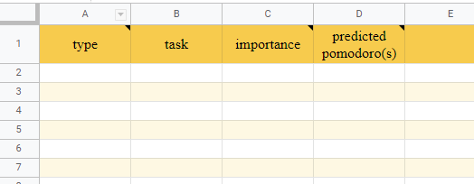

<!--more--> 

在上个学期的时间管理中，我偶然发现了 Francesco Cirillo 开发的 [番茄技术](https://francescocirillo.com/pages/pomodoro-technique)。虽然这是我很久以前就听说过的事情，但我还是决定试一试。这一次，我用谷歌工作表作为我的番茄追踪器。

我已经将跟踪器分为 3 个工作表，它们是（1）今天的待办事项，（2）每日日志，和（3）待办事项（见下图）。我会用待办事项来记录我的总体目标，不管是短期目标还是长期目标。然后，在每天开始的时候，我会选择一些我想要关注的任务，并将它们放在今天的待办事项中，在每天结束的时候，我会手动输入今天完成的任务，并将它们组织到每日日志中，这是一张详细的表格，记录了我每天完成任务的内容。




在将今天的待办事项中的信息手动转移到日常日志中一段时间后，我厌倦了繁琐的“复制和粘贴”过程。考虑到这可能是一个学习一些新技能的好机会，我使用相对简单的 [gspread API](https://docs.gspread.org/en/latest/api.html) 查找了如何阅读和编写谷歌工作表，结果只需运行一个简短的代码就可以节省很多时间。

## 演示文件（跟上！）

如果你想获得亲身体验，你可以使用演示文件与我一起编码。欢迎你进行调整和改进，以使自己适合自己。

* [填充 log.ipynb:python 代码](https://colab.research.google.com/drive/1Fv7dPlDlfu4ncWpW4evg6mk5lZd3fF4l#scrollTo=9eA649f6cosl)
* [番茄技术 Google Sheets ](https://docs.google.com/spreadsheets/d/1oogWtA5vSlcZTYzYL1CDrv4FIytao2MBBq6UmCKHLK4/edit#gid=0)

## 1. 进口

```code
import pandas as pd
from google.colab import auth
import gspread
from oauth2client.client import GoogleCredentials
from datetime import date, datetime
import pytz
import os
import json
```

## 2. 认证和授权

```code 
auth.authenticate_user()
gc = gspread.authorize(GoogleCredentials.get_application_default())
```

第一步是使 Google Sheets API 能够访问你的电子表格。" 身份验证和授权机制分别用于验证身份和对资源的访问。“你可以了解有关身份验证和授权 [here](https://developers.google.com/workspace/guides/auth-overview) 的更多信息。

但实际上，一旦你运行了这两行代码，一个 URL 就会弹出，并在浏览器中打开一个新的选项卡，该选项卡要求你授予访问权限。之后，复制 URL 并将其粘贴到“验证”框中。

## 3. 找回你的床单

```code
url = "https://docs.google.com/spreadsheets/d/1oogWtA5vSlcZTYzYL1CDrv4FIytao2MBBq6UmCKHLK4/edit#gid=0"
wb = gc.open_by_url(url)
todosheet = wb.worksheet("Today's To-Do")
logsheet = wb.worksheet("Daily Log")
```

接下来，我们准备好打开我们的电子表格。请记住上面的 ```gc``` 变量，它存储了一个你实际上不需要知道的 Client_Class 实例。[``gc.open_by_url``](https://docs.gspread.org/en/latest/api.html#gspread.Client.open_by_url) 通过 URL 打开电子表格并返回电子表格实例 ```wb```。通过更改 ```wb.worksheet(???)``` 的名称参数，我们可以检索相应的工作表。

## 4. 操作检索到的工作表数据

在我的例子中，因为我想将单元格数据读入列表（表示行）并将其写到新的工作表中，所以我以我认为合适的方式对其进行了操作。返回的 ```newList``` 将用于填充“每日日志”工作表。

```code
data = todosheet.get_all_values()

df_todo = pd.DataFrame(data)
df_todo.columns = df_todo.iloc[0]
df_todo = df_todo.drop(0)
df_todo = df_todo.reset_index(drop=True)
header = df_todo.columns.tolist()
rowsList = df_todo.to_numpy().tolist()

'''
return a list of lists to populate the log sheet
will only add tasks that have already been done
'''
def createPopulateData(rowsList):
  newList = []
  for row in rowsList:
    rowList = []
    task = row[header.index('task')]
    status = row[header.index('status')]
    if task == "" or status == "":
      break
    start_time = row[header.index('start time')]
    stepType = row[header.index('step/type')]
    pomos = row[header.index('pomodoro(s)')]
    pomoNum, intDistract, extDistract = 0, 0, 0
    for sign in pomos:
      if sign == "x":
        pomoNum += 1
      elif sign == "-":
        extDistract += 1
      elif sign == "'":
        intDistract += 1
      else:
        continue
    if pomoNum == 0:
      continue
    tz = pytz.timezone("US/Central")
    todayDate = datetime.now(tz).strftime("%m/%d/%y") # assumes the author runs the script before local 11:59 pm
    notes = row[header.index('notes')]
    rowList.extend([todayDate, start_time, stepType, task, pomoNum, intDistract, extDistract, notes])
    newList.append(rowList)
  return newList

newList = createPopulateData(rowsList)
```

## 5. 简化更新流程

如果我希望重写，因为我已经对我的“今天的工作”表做了一些其他的修改，该怎么办？因为默认情况下 [``sheet.append_rows（）``](https://docs.gspread.org/en/latest/api.html#gspread.worksheet.Worksheet.append_rows) 函数追加到表的最后一行之后，而我不希望这样，所以在最初运行代码时，我创建了一个 marks.json 文件，该文件记录了范围的起始索引，以及这是否是一个更新操作。如果这是一个更新操作（除了第一次运行代码，其余都被认为是更新），我将切换到使用 [``sheet.update（）``](https://docs.gspread.org/en/latest/api.html#gspread.worksheet.Worksheet.update)，因为它将更新并反映我对 Sheet 所做的新更改。

```code
path = "/content/marks.json"
if not os.path.exists(path):
  start = len(logsheet.col_values(1)) + 1
  marks = {}
  marks["start"] = start
  marks["update"] = False
  with open(path, "w") as f:
    json.dump(marks, f)
else:
  with open(path) as f1:
    marks = json.load(f1)
    marks["update"] = True
  with open(path, "w") as f2:
    json.dump(marks, f2)

with open(path) as f:
  marks = json.load(f)
  start, update  = marks["start"], marks["update"]

'''
do not delete Today's To-Do sheet until satisfied with Daily log editing
because starting index of rows range to append is fixed
'''
append = len(newList) - 1
end = marks["start"] + append

if not update:
  print(f"append {len(newList)} rows to Daily Log")
  res = logsheet.append_rows(newList, table_range=f"A{start}:H{end}")
else:
  print(f"update {len(newList)} rows to Daily Log")
  res = logsheet.update(f"A{start}:H{end}", newList)

if len(newList) == 0:
  print("no finished task to append or update yet :)")

res
```

最后，```res``` 对象包括一个自动响应，该响应告诉我们已经添加或更新了什么，以确认我们是否做了正确的事情。

